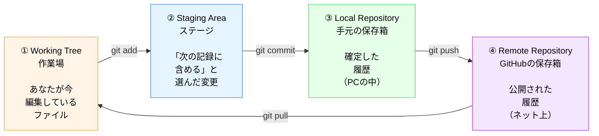
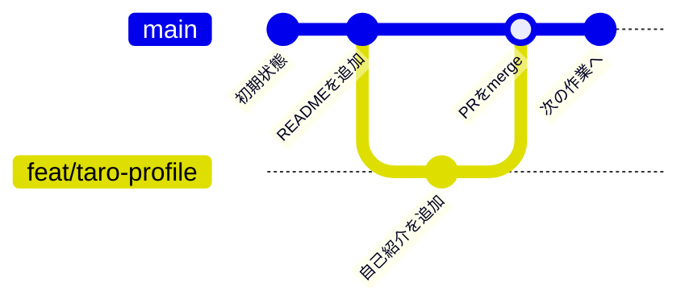

# 01. GitとGitHubの違い・4領域モデル

**所要：5分** ｜ 前 → [00. ターミナルの基礎](00_terminal_basics.md) ｜ 次 → [02. 草の話](02_kusa.md)

このページのゴール：**「今、自分の変更がどこにあるのか」を説明できるようになる。**

これが分かると、後で出てくるコマンドが**全部同じ話**だと分かります。
そして番外編2（[AIエージェント](07_extra_ai_git.md)）で、AIが何をしたのかを読めるようになります。

---

## GitとGitHubは別物です

名前が似ているので混乱しますが、**全く別のもの**です。

|  | Git | GitHub |
|---|---|---|
| 何か | **道具（ソフト）** | **場所（Webサービス）** |
| どこにある | あなたのPCの中 | インターネット上 |
| 何をする | 変更の履歴を記録する | 記録を置いて、他人と共有する |
| 作った人 | Linuxを作った人 (2005年) | 別の会社（今はMicrosoft） |
| ネットが必要か | **不要**（オフラインで動く） | 必要 |

### たとえるなら

> **Git = カメラ** ｜ **GitHub = 写真共有サービス**

- カメラ（Git）は手元にあって、ネットが無くても撮影（記録）できます
- 撮った写真を人に見せたい時に、共有サービス（GitHub）にアップロードします
- **カメラだけでも使えます。** GitHubは無くてもGitは機能します

もう一つのたとえ：

> **Git = セーブ機能** ｜ **GitHub = クラウドセーブ**

ゲームで手元にセーブ（Git）するのと、それをクラウドに預けて別の端末から読み込めるようにする（GitHub）のと同じ関係です。

### だから、こうなります

- `git commit` は**あなたのPCの中だけ**で完結します（ネット不要）
- `git push` で**初めてGitHubに送られます**（ネット必要）
- **commitしただけではGitHubには何も無い** ← ここ超重要

「commitしたのにGitHubに反映されていない！」の答えは、**pushしていない**です。

---

## 4領域モデル

Gitを理解する上でいちばん大事な図です。

**あなたの変更は、4つの場所のどこかにあります。** それだけの話です。



> 💡 上の図が表示されない場合は、GitHub上でこのファイルを開くと図として見えます。

### 4つの場所

| # | 名前 | 日本語で言うと | どこにある | ここに来る操作 |
|---|---|---|---|---|
| ① | Working Tree | **作業場** | PC | ファイルを編集する |
| ② | Staging Area | **ステージ（控え室）** | PC | `git add` |
| ③ | Local Repository | **手元の保存箱** | PC | `git commit` |
| ④ | Remote Repository | **GitHubの保存箱** | ネット | `git push` |

**①②③はあなたのPCの中。④だけがインターネット上です。**

---

## 荷物の発送でたとえる

この4領域は、**荷物を送る流れ**とそっくりです。

| 段階 | 荷物で言うと | Gitで言うと |
|---|---|---|
| ① 作業場 | 部屋に物が散らかっている | ファイルを編集した |
| ② ステージ | **送る物だけを箱に入れた** | `git add` した |
| ③ ローカル | **箱にガムテープを貼って封をした** | `git commit` した |
| ④ リモート | **郵便局に持って行った** | `git push` した |

ポイントは②です。

**部屋にある物を全部送るわけではありません。** 送りたい物だけを箱に入れます。
Gitも同じで、**編集したファイルのうち、記録に含めたいものだけを `git add` で選びます。**

> 「なんでわざわざ2段階なの？直接commitさせてよ」と思いますよね。
> 理由は、**1回のcommitに意味のある変更だけをまとめるため**です。
> たとえば「機能追加」と「誤字修正」を同時に作業してしまった時、`git add` で分けて、
> 2つのcommitにできます。後から片方だけ取り消せるようになります。

---

## `git status` は「今どの段階か」を教えてくれる

**4領域のどこに何があるかを表示するコマンド**です。

迷ったら `git status`。[00](00_terminal_basics.md) の `pwd` と並ぶ、今日の二大「迷ったらこれ」です。

### パターン1：ファイルを作った直後（① 作業場にいる）

```bash
git status
```

**期待する出力**
```
On branch feat/taro-yamada-profile

Untracked files:
  (use "git add <file>..." to include in what will be committed)
	members/taro-yamada.md

nothing added to commit but untracked files present (use "git add" to track)
```

> **Untracked files**＝ Gitがまだ知らないファイル。「部屋に置いてあるけど、まだ箱に入れていない物」です。
> **赤色**で表示されます（ターミナルによります）。

### パターン2：`git add` した後（② ステージにいる）

```bash
git add members/taro-yamada.md
git status
```

**期待する出力**
```
On branch feat/taro-yamada-profile

Changes to be committed:
  (use "git restore --staged <file>..." to unstage)
	new file:   members/taro-yamada.md
```

> **Changes to be committed**＝ 次のcommitに含まれる変更。「箱に入れた物」です。
> **緑色**で表示されます。

**赤 → 緑に変わったら `git add` 成功。** これが目印です。

### パターン3：`git commit` した後（③ ローカルにいる）

```bash
git commit -m "feat: taro-yamada の自己紹介を追加"
git status
```

**期待する出力**
```
On branch feat/taro-yamada-profile
nothing to commit, working tree clean
```

> **working tree clean**＝ 作業場に未記録の変更が無い状態。**きれいに片付いた、という good news です。**

### パターン4：`git push` した後（④ GitHubにいる）

pushすると、GitHubのページを開いた時にあなたのファイルが見えるようになります。
ここで初めて、**他人があなたの変更を見られる**ようになります。

---

## `git diff` は「何を変えたか」を見せてくれる

`git status` が「**どの段階か**」を教えてくれるのに対し、
`git diff` は「**中身が何から何に変わったか**」を見せてくれます。

```bash
git diff
```

**期待する出力**（例）
```diff
diff --git a/members/taro-yamada.md b/members/taro-yamada.md
index 1a2b3c4..5d6e7f8 100644
--- a/members/taro-yamada.md
+++ b/members/taro-yamada.md
@@ -1,3 +1,4 @@
 # 山田太郎
 
 ## 所属
+慶應義塾大学 経済学部 2年
```

### 読み方（ここだけ覚えればOK）

| 記号 | 意味 |
|---|---|
| `+` で始まる行 | **追加された行** |
| `-` で始まる行 | **削除された行** |
| 記号なしの行 | 変わっていない行（前後の文脈として表示） |

上の例は「`慶應義塾大学 経済学部 2年` という行を1行追加した」という意味です。

> `diff --git ...` や `index 1a2b...` の行は機械向けの情報です。**読み飛ばして構いません。**

### なぜdiffが大事なのか

**「自分が何を変えたか」を自分で確認するため**です。

コミットする前にdiffを見る習慣があると、
- `.env` を間違えて含めていないか（→ [06_safety.md](06_safety.md)）
- デバッグ用の `print()` を消し忘れていないか
- 意図しないファイルが混ざっていないか

を防げます。

そして、**番外編2でAIエージェントにGit操作を任せる時、あなたがすべき唯一の仕事がこのdiffの確認です。**
→ [07_extra_ai_git.md](07_extra_ai_git.md)

> 💡 diffが長くて画面が止まった（`:` が出て動かない）時は、**`q` キー**を押すと戻れます。
> これは今日いちばん多い「画面が固まった！」の正体です。壊れていません。

---

## ブランチ＝もう1つの作業ライン

4領域とは別に、もう1つだけ概念があります。**ブランチ**です。

> **ブランチ**＝ 枝。本線（`main`）から分岐した、自分専用の作業ライン。



### なぜブランチが必要か

**30人が同時に `main` を直接編集したら、確実に壊れるからです。**

ブランチを切ると：
- あなたの作業は**あなたのブランチの中だけ**で進む
- `main` は常に動く状態のまま保たれる
- 完成したらPRを出して、確認してもらってから `main` に合流させる

**これが今日やるGitHub Flowです。** → [04_branch_pr.md](04_branch_pr.md)

> 💡 ブランチを切っても、**ファイルが複製されるわけではありません。**
> `git switch` でブランチを切り替えると、**同じフォルダの中身が瞬時に切り替わります。**
> 最初は不思議ですが、Gitがファイルを入れ替えてくれていると思っておけばOKです。

---

## 今日のコマンドは、全部この図の話です

| コマンド | 4領域で言うと |
|---|---|
| `git clone` | ④ → ①③ をまるごとPCにコピーする（最初の1回だけ） |
| `git status` | **今どこに何があるか**を表示 |
| `git diff` | ① の中身が何から何に変わったかを表示 |
| `git add` | ① → ② に移す |
| `git commit` | ② → ③ に確定させる |
| `git push` | ③ → ④ に送る |
| `git pull` | ④ → ① に取り込む |
| `git log` | ③ に溜まった履歴を見る |

**Gitのコマンドが覚えられない、という悩みの正体は「どこからどこへ動かすのか分かっていない」ことです。**
この図さえ頭にあれば、コマンドは後から引けます（→ [03_basic_commands.md](03_basic_commands.md) が逆引き辞典です）。

---

## このページのまとめ

- **Git = 手元の道具、GitHub = ネット上の置き場所。別物。**
- 変更は **① 作業場 → ② ステージ → ③ 手元の保存箱 → ④ GitHub** と進む
- **commitしただけではGitHubに無い。pushして初めて届く**
- **迷ったら `git status`。何を変えたか知りたければ `git diff`**
- ブランチ＝自分専用の作業ライン。`main` を壊さないために切る

**次 → [02. 草の話](02_kusa.md)**
