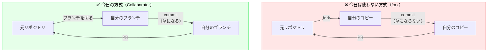

# 02. 草の話 — GitHubの緑のマス目

**所要：3分** ｜ 前 → [01. GitとGitHub](01_git_vs_github.md) ｜ 次 → [03. 基本コマンド](03_basic_commands.md)

このページのゴール：**今日の作業で確実に草を生やし、生えなかった時に自分で原因を特定できるようになる。**

---

## 草ってなに？

GitHubのプロフィールページ（`https://github.com/あなたのID`）に出る、**緑色のマス目**のことです。

正式名称は **Contribution Graph**（コントリビューショングラフ）。

```
        Mar   Apr   May   Jun   Jul   Aug
 Mon  □ □ ■ □ □ ■ ■ □ □ □ ■ □ □ □ ■ ■ ■ □ □ □ □ □ □ □
 Wed  □ ■ ■ ■ □ □ ■ □ ■ □ □ □ ■ ■ ■ ■ □ □ ■ □ □ □ □ □
 Fri  □ □ ■ ■ ■ □ □ □ □ ■ ■ □ □ ■ □ □ ■ ■ ■ □ □ □ □ □
```

- 1マス＝1日
- **その日に活動があると色がつきます**
- 活動量が多いほど濃い緑になります

「草が生える」＝「その日のマスが緑になる」という意味のネットスラングです。

---

## 草の文化について、正直な話

### 良い面

- **継続の可視化** — 毎日少しずつ手を動かしたことが目に見えて残ります
- **学習のモチベーション** — 「今日も1マス埋めよう」が習慣化のきっかけになります
- **活動の証跡** — インターンや就活で「実際に手を動かしています」と示す材料になります

### 気をつけたい面

- **草の量 ≠ エンジニアとしての実力**です
- 意味のないコミットを量産して草を稼ぐのは、履歴を汚すだけで誰も評価しません
- 業務のコードは会社のプライベートリポジトリにあるため、**優秀なエンジニアでも草が真っ白なことは普通にあります**

**今日は「草を生やすこと」が目的ではありません。**
「PRを出してmergeされる」という**実務そのままの流れを体験すること**が目的で、草はその**結果として自然についてくるご褒美**です。

とはいえ、初めて緑が1マス点くのは普通に嬉しいので、確実に生やしましょう。

---

## カウントされる条件

以下のどれかをやると、その日の草が生えます。

| 活動 | 草になる？ |
|---|---|
| コミットして、**GitHubにpushする** | ✅ なる（条件あり↓） |
| **Issueを立てる** | ✅ なる |
| **Pull Requestを出す** | ✅ なる |
| Pull Requestのレビューをする | ✅ なる |
| Discussionを立てる/回答する | ✅ なる |

**今日のハンズオンでは、コミット・PR作成の両方をやるので、確実に生えます。**

### コミットで草が生えるための3条件

コミットについては、**追加で3つの条件**があります。ここが罠の温床です。

| # | 条件 |
|---|---|
| 1 | コミットの**メールアドレス**が、GitHubアカウントに登録済みのメールと一致している |
| 2 | コミットが **default branch（通常 `main`）か `gh-pages`** に存在する、**または** そのコミットを含むPRを出している |
| 3 | リポジトリが **fork（他人のリポジトリのコピー）ではない** |

---

## カウントされない条件 ← ここが罠

### 罠1：`git config` のメールアドレスが違う ← **いちばん多い**

**症状**：コミットもpushも成功しているのに、草が生えない。GitHub上でコミットのアイコンが**灰色のシルエット**になっている。

**原因**：コミットに記録されたメールアドレスが、GitHubアカウントに登録されていない。

Gitは、コミットするたびに「誰が作ったか」をメールアドレスで記録します。
GitHubは、そのメールアドレスを見て「これは誰のコミットか」を判定します。
**アドレスが一致しなければ、GitHubは「知らない人のコミット」として扱い、あなたの草にはなりません。**

**確認方法**

```bash
git config --global user.email
```

**期待する出力**
```
taro@example.com
```

これが、GitHubの [Settings → Emails](https://github.com/settings/emails) に載っているアドレスのどれかと**完全に一致**している必要があります。

**直し方**

```bash
git config --global user.email "GitHubに登録済みのアドレス"
```

> ⚠️ **これを直しても、すでに作ったコミットの草は生えません。**
> メールアドレスはコミット作成時に焼き付けられるためです。
> 直した後に新しくコミットすれば、そこから草が生えます。
> （過去のコミットも修正できますが、初級編の範囲外です）

**もう1つの解決策：GitHubの noreply アドレスを使う**

メールアドレスを公開したくない人向けに、GitHubは専用アドレスをくれます。

1. https://github.com/settings/emails を開く
2. `Keep my email addresses private` にチェック
3. すぐ下に表示される `12345678+taro-yamada@users.noreply.github.com` をコピー
4. そのアドレスを設定する：

```bash
git config --global user.email "12345678+taro-yamada@users.noreply.github.com"
```

**これが最も安全で確実です。** メールを公開せずに草も生えます。

---

### 罠2：fork したリポジトリでのコミット

**forkの中で作ったコミットは、草になりません。**

> **fork**＝ 他人のリポジトリを、自分のアカウントにコピーすること。

理由：forkは元リポジトリのコミットを全部コピーするので、
これを草にすると「有名リポジトリをforkするだけで草が数万個生える」ことになってしまうからです。

**ただし例外があります。** fork から出したPRが**元のリポジトリにmergeされれば**、そのコミットは草になります。
また、「PRを出した」という行為自体は fork でも草になります。

### 💡 だから、今日はforkを使いません

今日は全員を **Collaborator**（このリポジトリに直接書き込める人）として招待しています。



**Collaboratorとして直接ブランチを切るので：**
- fork の概念を今日覚える必要がない（手順が2ステップ短い）
- **コミットの草が確実に生える**（forkではないので）
- remote が1つだけで済む（forkだと `origin` と `upstream` の2つを管理することになる）

事前課題の「招待メールを承認する」が最優先だったのは、この理由です。

> 💡 forkは、**書き込み権限がない他人のリポジトリ（OSS）に貢献する時**に使う方式です。
> 今日は使いませんが、いずれ必ず使うことになります。「そういうやり方もある」と覚えておいてください。

---

### 罠3：ブランチにcommitしただけで、PRを出していない

`main` 以外のブランチにcommitしてpushしただけでは、**草になりません。**

草になるのは：
- `main`（default branch）にあるコミット
- **PRに含まれているコミット**

**今日はPRを出すので問題ありません。**
push したのに草が無い、という時は、**PRを出す手順まで進んでいるか**確認してください。

---

### 罠4：プライベートリポジトリの活動が非表示になっている

プライベートリポジトリの草は、**デフォルトでは他人から見えません**（自分には見えます）。

「他の人からも見えるようにしたい」場合：

1. 自分のプロフィールページを開く
2. 草のグラフの右上あたりにある **Contribution settings** をクリック
3. **Private contributions** にチェック

> 今日のリポジトリは Public なので、この設定は関係ありません。

---

### 罠5：反映が遅れているだけ

**草の反映には数分〜十数分かかることがあります。**

pushもPRも成功しているのに草が無い場合、**まず5分待ってからページをリロード**してください。
講座中は焦りますが、大抵これです。

---

## 草が生えない時のチェックリスト

上から順に確認してください。

| # | 確認すること | やり方 |
|---|---|---|
| 1 | **5分待ってリロードしたか** | ブラウザを再読み込み |
| 2 | pushは成功しているか | GitHub上で自分のブランチにファイルが見えるか |
| 3 | PRは出したか | https://github.com/guousuides/git-lec/pulls に自分のPRがあるか |
| 4 | **コミットのメールは合っているか** | GitHub上でコミットを開き、アイコンが灰色シルエットでないか |
| 5 | `git config` の設定は？ | `git config --global user.email` を実行して確認 |
| 6 | GitHubに登録済みのアドレスか | https://github.com/settings/emails と見比べる |

### 4番の見分け方（決定版）

1. GitHub上で自分のPRを開く
2. **Commits** タブをクリック
3. コミットの左のアイコンを見る

| 見た目 | 意味 |
|---|---|
| **あなたのアイコン画像 + IDがリンクになっている** | ✅ 正しく紐付いている。草は生えます |
| **灰色の人型シルエット + IDがただの文字** | ❌ メールが一致していません。罠1の対処を |

**これが最も確実な判定方法です。** 迷ったらここを見てください。

---

## このページのまとめ

- 草＝プロフィールの緑のマス目。**commit / issue / PR で生える**
- **草の量は実力ではない。** 今日は「PRを出す流れの体験」がメインで、草はご褒美
- **最大の罠は `git config user.email` の不一致。** これが違うと何をしても生えません
- **fork内のcommitは草にならない。** だから今日はCollaborator方式にしています
- 生えない時は、**GitHub上のコミットのアイコンが灰色シルエットかどうか**を見る

**次 → [03. 基本コマンド](03_basic_commands.md)**
