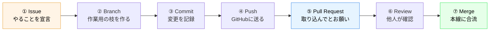

# 04. ブランチとPR — ハンズオン本編

**所要：12分** ｜ 前 → [03. 基本コマンド](03_basic_commands.md) ｜ 次 → [06. 安全な使い方](06_safety.md)

**ここが今日のメインです。** ここを終えると、あなたのPRがmergeされ、草が生えます。

> マウス操作だけで進めたい方 → [08_gui_version.md](08_gui_version.md)（同じことをVS Codeでやります）
> 途中でGUI版に乗り換えても大丈夫です。手を挙げてください。

---

## 最初に、心構え

**エラーは出ます。全員出ます。**

エラーが出たら、それは**あなたが間違えたのではなく、Gitが「今この状態だよ」と教えてくれている**だけです。
各ステップに「よくあるエラー」を書いてあるので、慌てずに読んでください。

そして：**このハンズオンで壊せるものは何もありません。**
最悪の場合、フォルダを消してもう一度 `git clone` すれば完全に元通りになります。

---

## 今日やることの全体像：GitHub Flow

**実務のチームが毎日やっている流れ**そのものです。名前が付いていて、**GitHub Flow** と言います。



| # | ステップ | 一言で言うと |
|---|---|---|
| ① | **Issue** | 「これをやります」と宣言する投稿 |
| ② | **Branch** | `main` を壊さないための、自分専用の作業ライン |
| ③ | **Commit** | 変更を記録する（セーブ） |
| ④ | **Push** | 記録をGitHubに送る |
| ⑤ | **Pull Request** | 「この変更を取り込んでください」というお願い |
| ⑥ | **Review** | 他の人が内容を確認する |
| ⑦ | **Merge** | `main` に合流させる（完了！） |

**今日のゴールは⑦です。** では始めましょう。

---

## STEP 0：準備（1分）

### 0-1. ターミナルを開く

- **Windows** → Windowsキー → `git bash` と入力 → Git Bash
- **Mac** → command + スペース → `ターミナル` と入力 → Enter

### 0-2. 自分のGitHub IDを確認する

このハンズオンでは、**自分のGitHub ID**を何度も使います。手元にメモしてください。

```bash
gh api user --jq .login
```

**期待する出力**
```
taro-yamada
```

これが出なければ、GitHubにログインできていません → [README の事前課題4](../README.md#4-githubにログインできる状態にする認証設定)

> 💡 **以降、資料の `taro-yamada` の部分は、すべてあなたのIDに読み替えてください。**

### 0-3. ホームに戻る

作業場所を揃えるため、まずホームに戻ります。

```bash
cd ~
```

```bash
pwd
```

**期待する出力**（例）
```
/Users/taro          ← Mac
/c/Users/taro        ← Windows
```

---

## STEP 1：Issueを立てる（1分）

> **Issue**（イシュー）＝「これをやります」「ここが困っています」を書いておく投稿。
> チームの中で「誰が何をやっているか」を見えるようにするための仕組みです。

### 手順

1. https://github.com/guousuides/git-lec/issues を開く
2. 緑の **New issue** ボタンを押す
3. **`🎉 はじめてのPR（自己紹介ページを作る）`** の右にある **Get started** を押す
4. タイトルの `<あなたのGitHub ID>` を、自分のIDに書き換える
   - 例：`自己紹介ページを作る: taro-yamada`
5. 本文はそのままでOK
6. 緑の **Create** ボタンを押す

### できたら

**画面上部に `#12` のような番号が出ます。この番号をメモしてください。**（後でPRから参照します）

> 🌱 **この時点で、今日の草はもう1つ生えています。** Issueを立てるのも立派なcontributionです。

---

## STEP 2：リポジトリをPCにコピーする（clone）（2分）

> **clone**（クローン）＝ GitHub上のリポジトリを、自分のPCにまるごとコピーすること。

```bash
git clone https://github.com/guousuides/git-lec.git
```

**期待する出力**
```
Cloning into 'git-lec'...
remote: Enumerating objects: 42, done.
remote: Counting objects: 100% (42/42), done.
Receiving objects: 100% (42/42), 15.23 KiB | 3.81 MiB/s, done.
Resolving deltas: 100% (5/5), done.
```

### コピーできたフォルダに入る

```bash
cd git-lec
```

**期待する出力**：何も出ません（成功）

### 🔴 必ず確認してください

```bash
pwd
```

**期待する出力**
```
/Users/taro/git-lec       ← 末尾が /git-lec になっていること
```

```bash
ls
```

**期待する出力**
```
CONTRIBUTING.md    README.md    conflict-playground    docs    members    slides
facilitator_guide.md
```

> ⚠️ **ここから先のコマンドは、すべてこの `git-lec` フォルダの中で実行します。**
> 途中でエラーが出たら、まず `pwd` を打って、ここにいるか確認してください。
> **今日のトラブルの半分はこれです。**

### よくあるエラー

**`destination path 'git-lec' already exists`**

→ すでにcloneしてあります。cloneし直さず、`cd git-lec` で入るだけでOKです。

**`Repository not found`**

→ Collaborator招待を承認していない可能性があります。
https://github.com/notifications を開いて招待を承認してください。

**`could not read Username` / `Authentication failed`**

→ ログインできていません。`gh auth login` をやり直してください。

---

## STEP 3：ブランチを作る（1分）

> **ブランチ**＝ `main` から分岐した、自分専用の作業ライン。
> ここで何をしても `main` は無傷です。だから安心して作業できます。

### なぜブランチを切るのか

**30人が同時に `main` を直接編集したら、確実に壊れるからです。**

ブランチを切れば、あなたの作業は完成するまで誰にも影響しません。

### 手順

ブランチ名のルール（[CONTRIBUTING.md](../CONTRIBUTING.md)）に従って作ります。

```bash
git switch -c feat/taro-yamada-profile
```

> ⚠️ **`taro-yamada` を自分のGitHub IDに書き換えてください。**

**期待する出力**
```
Switched to a new branch 'feat/taro-yamada-profile'
```

### 確認

```bash
git branch
```

**期待する出力**
```
* feat/taro-yamada-profile
  main
```

`*` が自分のブランチに付いていればOKです。

### よくあるエラー

**`fatal: not a git repository`**

→ `git-lec` フォルダの外にいます。

```bash
pwd
```

で確認して、`git-lec` の中でなければ：

```bash
cd ~/git-lec
```

**`a branch named '...' already exists`**

→ すでに作ってあります。作らずに移動するだけでOK：

```bash
git switch feat/taro-yamada-profile
```

---

## STEP 4：自己紹介ファイルを作る（3分）

**ここが唯一、あなたが「中身を書く」ステップです。**

### 4-1. テンプレートをコピーする

```bash
cp members/_TEMPLATE.md members/taro-yamada.md
```

> `cp` = **c**o**p**y（コピーする）。`cp コピー元 コピー先` の順で書きます。
> ⚠️ **`taro-yamada` を自分のGitHub IDに書き換えてください。**
> ⚠️ **ファイル名は必ず `.md` で終わらせてください。**

**期待する出力**：何も出ません（成功）

**確認**：

```bash
ls members/
```

**期待する出力**
```
README.md    _TEMPLATE.md    cypher-cto.md    taro-yamada.md
```

自分のファイルが増えていればOKです。

### 4-2. ファイルを編集する

**方法A：VS Codeで開く（推奨）**

```bash
code members/taro-yamada.md
```

VS Codeが開きます。編集して、**保存（command+S / Ctrl+S）**してください。

> `code: command not found` と出る場合：
> VS Codeを起動 → command+Shift+P（Winは Ctrl+Shift+P）→ `shell command` と入力 →
> `Shell Command: Install 'code' command in PATH` を選択 → ターミナルを開き直す
>
> それでもダメなら方法Bへ。

**方法B：普通にファイルを開く**

1. Finder（Mac）/ エクスプローラー（Windows）で `git-lec/members/` を開く
2. 自分のファイルをダブルクリック（テキストエディタで開きます）
3. 編集して保存

**方法C：ターミナル内で編集する（上級者向け）**

`nano` という簡易エディタを使います。

```bash
nano members/taro-yamada.md
```

編集後、**Ctrl + O** → Enter（保存）→ **Ctrl + X**（終了）

### 4-3. 何を書くか

テンプレートの `<>` で囲まれた部分を埋めてください。**全部埋めなくてOKです。**

書きたくないことは書かなくて構いません。**1行でも埋まっていれば十分です。**

参考：[members/cypher-cto.md](../members/cypher-cto.md) に記入済みのサンプルがあります。

> ⚠️ **個人情報は書かないでください。** 本名・住所・電話番号・所属の詳細は不要です。
> このリポジトリはPublic（誰でも見られる）です。

### 4-4. 保存できたか確認する

```bash
git status
```

**期待する出力**
```
On branch feat/taro-yamada-profile

Untracked files:
  (use "git add <file>..." to include in what will be committed)
	members/taro-yamada.md

nothing added to commit but untracked files present (use "git add" to track)
```

**自分のファイル名が（赤色で）出ていればOKです。**

> **Untracked files**＝ Gitがまだ知らないファイル。これは正常です。
> 今、あなたの変更は **① 作業場** にあります。（→ [01. 4領域モデル](01_git_vs_github.md)）

---

## STEP 5：変更を記録する（add → commit）（2分）

### 5-1. ステージに乗せる（① → ②）

```bash
git add members/taro-yamada.md
```

**期待する出力**：何も出ません（成功）

**確認**：

```bash
git status
```

**期待する出力**
```
On branch feat/taro-yamada-profile

Changes to be committed:
  (use "git restore --staged <file>..." to unstage)
	new file:   members/taro-yamada.md
```

**`Untracked files`（赤）→ `Changes to be committed`（緑）に変わっていればOK。**

### 5-2. 【重要】何を記録するのか、自分で確認する

```bash
git diff --staged
```

**期待する出力**（例）
```diff
diff --git a/members/taro-yamada.md b/members/taro-yamada.md
new file mode 100644
--- /dev/null
+++ b/members/taro-yamada.md
@@ -0,0 +1,15 @@
+# taro-yamada
+
+## ひとこと
+機械学習を勉強中です！
...
```

- `+` の行 = 追加される行
- **自分のファイルだけが出ていることを確認してください**
- 画面が止まったら **`q`** を押して抜けます

> 💡 **この「commitする前に diff を見る」習慣が、今日いちばん持って帰ってほしいものです。**
> これをやっていれば、パスワードを間違えてGitHubに公開する事故（→ [06_safety.md](06_safety.md)）は起きません。
> そして番外編2でAIにGit操作を任せる時、**この確認があなたの仕事になります**（→ [07_extra_ai_git.md](07_extra_ai_git.md)）。

### 5-3. 記録を確定する（② → ③）

```bash
git commit -m "feat: taro-yamada の自己紹介を追加"
```

> ⚠️ `taro-yamada` を自分のIDに。メッセージは**ダブルクォート `"` で囲みます。**

**期待する出力**
```
[feat/taro-yamada-profile 3a4b5c6] feat: taro-yamada の自己紹介を追加
 1 file changed, 15 insertions(+)
 create mode 100644 members/taro-yamada.md
```

**`1 file changed` と出ていればOK。** 🎉 初commitです。

### よくあるエラー

**`Please tell me who you are`**

→ `git config` が終わっていません。表示された通りのコマンドを実行してください：

```bash
git config --global user.name "あなたのGitHub ID"
git config --global user.email "GitHubに登録したメールアドレス"
```

その後、`git commit` をもう一度実行します。

**謎のエディタが開いて操作不能**

→ `-m "メッセージ"` を書き忘れています。**`Esc` → `:q!` → Enter** で脱出して、打ち直してください。

**`nothing to commit, working tree clean`**

→ `git add` を忘れています。STEP 5-1 に戻ってください。

---

## STEP 6：GitHubに送る（push）（1分）

> ここまでの変更は、**まだあなたのPCの中にしかありません。** pushして初めてGitHubに届きます。

```bash
git push -u origin feat/taro-yamada-profile
```

> ⚠️ ブランチ名を自分のものに書き換えてください。

**期待する出力**
```
Enumerating objects: 6, done.
Counting objects: 100% (6/6), done.
Writing objects: 100% (4/4), 512 bytes | 512.00 KiB/s, done.
To https://github.com/guousuides/git-lec.git
 * [new branch]      feat/taro-yamada-profile -> feat/taro-yamada-profile
branch 'feat/taro-yamada-profile' set up to track 'origin/feat/taro-yamada-profile'.

remote: Create a pull request for 'feat/taro-yamada-profile' on GitHub by visiting:
remote:      https://github.com/guousuides/git-lec/pull/new/feat/taro-yamada-profile
```

**`* [new branch]` と出ていればOK。** 🎉 あなたの変更がインターネット上に届きました。

> 💡 **最後に出ているURLは、PR作成画面への直リンクです。** STEP 7 で使えます。

### よくあるエラー

**`Authentication failed` / `could not read Username`**

→ GitHubにログインできていません。

```bash
gh auth login
```

を実行して、ブラウザ認証をやり直してください。**GitHubのパスワードは使えません。**

**`Permission denied` / `403 Forbidden`**

→ Collaborator招待を承認していません。
https://github.com/notifications を開いて **Accept invitation** を押してから、もう一度push。

**`Updates were rejected`**

→ 先に `git pull` を実行してから、もう一度push。

> ⚠️ ここで `git push --force` を使わないでください。**他の人の作業が消えます。**

---

## STEP 7：Pull Requestを出す（2分）

> **Pull Request（PR）**＝「この変更を `main` に取り込んでください」というお願いの投稿。
> **実務では、ほぼすべてのコード変更がこの形で行われます。**

### 方法A：ブラウザで作る（推奨）

1. https://github.com/guousuides/git-lec を開く
2. 画面上部に黄色い帯で
   **`feat/taro-yamada-profile had recent pushes`** と出ているはず
3. その右の緑の **Compare & pull request** ボタンを押す

> 黄色い帯が出ていない場合：
> **Pull requests** タブ → **New pull request** →
> `compare:` のドロップダウンから自分のブランチを選択

4. **タイトル**を確認・修正する

```
feat: taro-yamada の自己紹介を追加
```

5. **本文**にテンプレートが自動で入っています。**項目を消さずに、埋められるところを埋めてください**

- `close #12` の `12` を、STEP 1 でメモしたIssue番号に書き換える
  （こう書くと、mergeされた時にIssueが自動で閉じます）
- 分からない項目は「分かりません」でOKです

6. 緑の **Create pull request** ボタンを押す

### 方法B：ターミナルから作る

```bash
gh pr create --fill
```

対話形式で聞かれるので、矢印キーとEnterで答えます。
最後に `Submit` を選ぶと作成されます。

### できたら

**PRのページが開きます。番号（`#13` など）が付いていれば成功です。**

🎉 **ここまで来たら、今日の実質的なゴールは達成です。**

### 🔴 ここで必ず確認してください

PRページの **Files changed** タブを開いてください。

- ✅ **自分のファイル1つだけ**が緑（追加）で表示されている
- ❌ 他の人のファイルや、身に覚えのないファイルが混ざっている → **手を挙げてください**

> これも「diffを自分で確認する」の一種です。PRを出す前に必ず見る癖をつけてください。

### 🔴 コミットが自分のものになっているか確認する（草チェック）

同じPRページの **Commits** タブを開いてください。

| 見た目 | 判定 |
|---|---|
| **あなたのアイコン + IDがリンク** | ✅ OK。草が生えます |
| **灰色の人型シルエット + IDがただの文字** | ❌ メールが不一致。→ [02_kusa.md](02_kusa.md) |

灰色だった人は手を挙げてください。**その場で直せます。**

---

## STEP 8：レビューとmerge（1分）

### 進行役・運営がレビューします

> **レビュー**＝ 他の人が変更内容を確認すること。

- 問題なければ **Approve**（承認）されます
- コメントが付くこともあります。**それはダメだったという意味ではありません。**「こうするともっと良い」という提案です
- 実務では、コメントゼロでmergeされるPRの方が珍しいです

### merge

承認されたら、緑の **Merge pull request** ボタンを押します。
（進行役が押す場合もあります。アナウンスに従ってください）

**期待する状態**：PRの表示が紫色の **Merged** に変わります。

## 🎉 完了です

**あなたの変更が `main` に入りました。**
https://github.com/guousuides/git-lec/tree/main/members に自分のファイルがあるはずです。

---

## STEP 9：草を確認する（1分）

1. https://github.com/あなたのGitHub-ID を開く
2. 下にスクロールして、緑のマス目を探す
3. **今日の日付のマスが緑になっていれば成功です** 🌱

### 緑になっていない場合

**まず5分待ってリロードしてください。** 反映に時間がかかります。

それでもダメな場合は [02_kusa.md のチェックリスト](02_kusa.md#草が生えない時のチェックリスト) を上から確認してください。
いちばん多いのは **`git config user.email` の不一致**です。

---

## STEP 10：後片付け（余裕があれば）

mergeされた後、手元も最新にしておきます。**実務では毎回やる作業です。**

```bash
git switch main
```

**期待する出力**
```
Switched to branch 'main'
Your branch is up to date with 'origin/main'.
```

```bash
git pull
```

**期待する出力**
```
Updating 1a2b3c4..9f8e7d6
Fast-forward
 members/taro-yamada.md | 15 +++++++++++++++
 ...
```

```bash
ls members/
```

自分のファイルに加えて、**他の受講者のファイルも増えているはずです。**
これが「チームで開発している」ということです。

---

## 今日やったことの振り返り

| STEP | やったこと | 4領域で言うと |
|---|---|---|
| 1 | Issue を立てた | （GitHub上の宣言） |
| 2 | `git clone` | ④ → ①③ にコピー |
| 3 | `git switch -c` | 自分の作業ラインを作った |
| 4 | ファイルを作成・編集 | ① 作業場 |
| 5 | `git add` → `git commit` | ① → ② → ③ |
| 6 | `git push` | ③ → ④ |
| 7 | Pull Request を作成 | 「取り込んで」とお願い |
| 8 | Review → Merge | `main` に合流 |

**この流れは、実務のエンジニアが毎日やっていることと完全に同じです。**
規模が違うだけで、やっていることは今日と1ミリも変わりません。

---

## 次にやること

| やること | 資料 |
|---|---|
| **もう1回やってみる**（自分のファイルを編集してPR） | このページをもう一周 |
| 秘密情報を守る方法を知る | [06_safety.md](06_safety.md) |
| **番外編1**：コンフリクトを経験する | [05_extra_conflict_revert.md](05_extra_conflict_revert.md) |
| **番外編2**：AIエージェントにGitを任せる | [07_extra_ai_git.md](07_extra_ai_git.md) |

> ⚠️ **番外編2は、必ず今日の手順を自分の手で1周してから読んでください。**
> AIに任せる話は、「何が起きているか読める人」にとってだけ便利な話です。
> **あなたはもう、その資格を得ました。**

**次 → [06. 安全な使い方](06_safety.md)**
