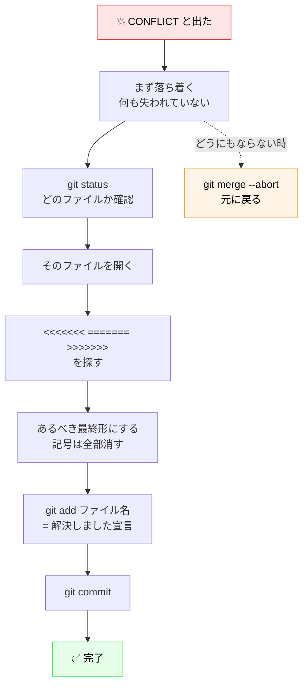
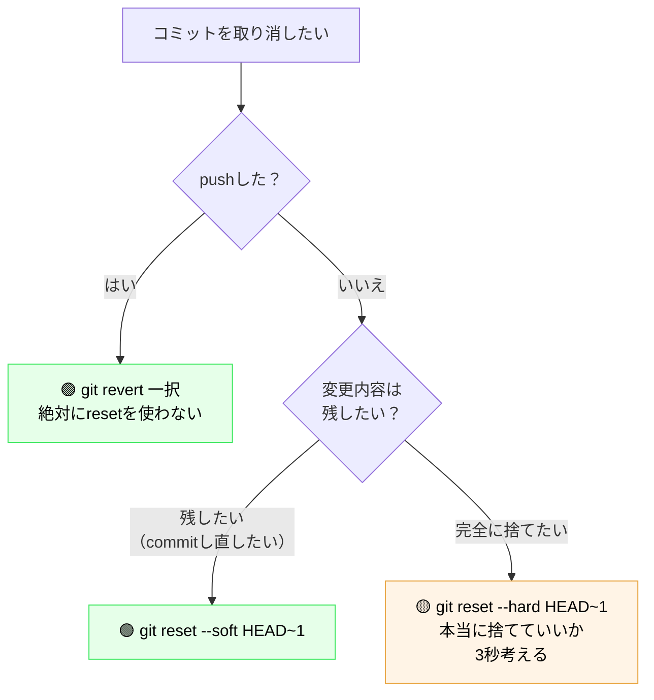

# 05. 番外編1 — コンフリクト解消と、取り消しの技術

**所要：10〜15分（本編とは別枠）** ｜ 前 → [04. ブランチとPR](04_branch_pr.md)

> ⚠️ **このページは、[04. ハンズオン本編](04_branch_pr.md) を自分の手で1周してから読んでください。**
> add / commit / push / PR の流れが手に馴染んでいないと、ここは「呪文の羅列」になります。

このページのゴール：
1. **コンフリクトが起きても、落ち着いて自力で解消できる**
2. **`revert` と `reset` の違いを説明でき、どちらを使うべきか判断できる**

---

# Part 1. コンフリクト

## コンフリクトってなに？

> **コンフリクト**（conflict / 競合）＝ **同じファイルの同じ行を、2人が別々に変更した**時に、
> Gitが「どっちを採用すればいいか分からない」と判断を人間に投げてくること。

### なぜ起きるのか

Gitは、実はほとんどの場合、**自動でうまく合体してくれます。**

| 状況 | Gitの判断 |
|---|---|
| AさんとBさんが**別のファイル**を変更 | ✅ 自動で合体 |
| AさんとBさんが**同じファイルの別の行**を変更 | ✅ 自動で合体 |
| AさんとBさんが**同じファイルの同じ行**を変更 | ❌ **コンフリクト** |

最後のケースだけ、Gitは手を止めます。
**「両方残す？Aを取る？Bを取る？それは意味の話だから、人間が決めて」**ということです。

### コンフリクトは「事故」ではありません

初心者がいちばん怖がるのがコンフリクトですが、**これはGitが正しく動いている証拠**です。

もしGitが勝手にどちらかを選んでいたら、**気づかないうちに誰かの変更が消えます。**
その方がはるかに恐ろしい。**止まってくれることが安全装置なんです。**

そして重要なこと：

> **コンフリクトが起きても、あなたのコミットも相手のコミットも1つも失われていません。**
> ただ「合体後の姿を決めてください」と聞かれているだけです。

### 今日の本編でコンフリクトが起きなかった理由

本編では、全員が `members/<自分のID>.md` という**別々の新規ファイル**を作りました。
**同じ行を触る人が誰もいないので、構造的にコンフリクトが起きません。**

これは意図的な設計です。初回で全員コンフリクトしたら、30分では終わりません。

**今から、わざとコンフリクトを起こします。**

---

## 実習：コンフリクトを体験する

練習場を用意してあります → [`conflict-playground/`](../conflict-playground/)

**このフォルダは壊してよい場所です。** 何をしても本編に影響しません。

### 事前準備（講師が実施済み）

講師が `conflict-playground/guestbook.md` の**同じ行**を書き換えたブランチを
`main` にmergeしてあります。あなたはそれを知らずに同じ行を編集します。

（講師向けの仕込み手順 → [conflict-playground/instructor_setup.md](../conflict-playground/instructor_setup.md)）

### STEP 1：最新を取得して、練習用ブランチを作る

```bash
cd ~/git-lec
git switch main
git pull
```

**期待する出力**
```
Already up to date.
```
または更新内容が表示されます。

```bash
git switch -c practice/taro-yamada-conflict
```

> `taro-yamada` を自分のIDに置き換えてください。

**期待する出力**
```
Switched to a new branch 'practice/taro-yamada-conflict'
```

### STEP 2：わざと衝突する行を編集する

`conflict-playground/guestbook.md` を開いてください。

```bash
code conflict-playground/guestbook.md
```

ファイルの中に、こう書いてある行があります：

```markdown
今日のひとこと: （ここを書き換えてください）
```

この行を、**自分の言葉に書き換えて保存**してください。例：

```markdown
今日のひとこと: Gitって意外と怖くないかも
```

### STEP 3：commitする

```bash
git add conflict-playground/guestbook.md
git commit -m "chore: guestbook のひとことを更新"
```

**期待する出力**
```
[practice/taro-yamada-conflict 7f8a9b0] chore: guestbook のひとことを更新
 1 file changed, 1 insertion(+), 1 deletion(-)
```

### STEP 4：`main` の変更を取り込もうとする → 💥 コンフリクト発生

```bash
git pull origin main
```

**期待する出力**
```
From https://github.com/guousuides/git-lec
 * branch            main       -> FETCH_HEAD
Auto-merging conflict-playground/guestbook.md
CONFLICT (content): Merge conflict in conflict-playground/guestbook.md
Automatic merge failed; fix conflicts and then commit the result.
```

**`CONFLICT` の文字が出れば成功です。** 🎉（成功、というのが変な感じですが、これが目的です）

> ⚠️ **ここでターミナルを閉じたり、フォルダを消したりしないでください。** 何も壊れていません。
> Gitは「作業を一時停止して、あなたの判断を待っている」状態です。

### STEP 5：状況を確認する

**慌てずに、まず `git status`。**

```bash
git status
```

**期待する出力**
```
On branch practice/taro-yamada-conflict
You have unmerged paths.
  (fix conflicts and run "git commit")
  (use "git merge --abort" to abort the merge)

Unmerged paths:
  (use "git add <file>..." to mark resolution)
	both modified:   conflict-playground/guestbook.md
```

読み方：

- **`both modified`** ← **これがコンフリクトしているファイル**です
- `(fix conflicts and run "git commit")` ← 次にやることが書いてあります
- `(use "git merge --abort" to abort the merge)` ← **逃げ道**も書いてあります

> 💡 **どうにもならなくなったら、いつでもこれで元に戻せます：**
> ```bash
> git merge --abort
> ```
> コンフリクトが起きる前の状態に完全に戻ります。**この逃げ道があることを知っていれば、怖くありません。**

### STEP 6：ファイルを開いて、中身を見る

```bash
code conflict-playground/guestbook.md
```

**中はこうなっています：**

```
<<<<<<< HEAD
今日のひとこと: Gitって意外と怖くないかも
=======
今日のひとこと: コンフリクトは怖くない
>>>>>>> 9f8e7d6c5b4a3f2e1d0c9b8a7f6e5d4c3b2a1f0e
```

### この記号の読み方

**これが読めれば、コンフリクトは終わったも同然です。**

| 記号 | 意味 |
|---|---|
| `<<<<<<< HEAD` | **ここから下が「自分の変更」** |
| `=======` | **区切り線** |
| `>>>>>>> 9f8e7d6...` | **ここまでが「相手の変更」** |

つまり：

```
<<<<<<< HEAD
   ← 自分が書いた内容
=======
   ← 相手が書いた内容
>>>>>>> （相手のコミットID）
```

> 💡 `HEAD` ＝「今自分がいる場所」を指すGitの用語です。ここでは「自分の変更」と読んでOKです。

### STEP 7：解消する — 「どうあるべきか」を決める

**やることは、たった1つです。**

> **記号を全部消して、ファイルを「あるべき最終形」にする。**

Gitはあなたに選択肢を提示していますが、**選ぶ必要すらありません。** 最終形にすればいいだけです。

選び方は3通りあります：

**選択肢A：自分の変更を採用する**

```markdown
今日のひとこと: Gitって意外と怖くないかも
```

**選択肢B：相手の変更を採用する**

```markdown
今日のひとこと: コンフリクトは怖くない
```

**選択肢C：両方活かす / 新しく書く**（実務ではこれが多い）

```markdown
今日のひとこと: コンフリクトは怖くない、Gitも意外と怖くない
```

**今回はどれでもOKです。** 好きなものを選んでください。

### 🔴 いちばん大事なチェック

**保存する前に、以下の3つの記号が1つも残っていないか確認してください。**

```
<<<<<<<
=======
>>>>>>>
```

> ⚠️ **この記号を消し忘れてcommitするのが、コンフリクト初心者の最頻出ミスです。**
> 記号が残ったままだと、ファイルが壊れた状態で本線に入ってしまいます。
> VS Codeなら、記号が残っていると色付きで目立つので気づけます。

### 💡 VS Codeを使うと、もっと簡単

VS Codeでコンフリクトしたファイルを開くと、記号の上に**ボタン**が出ます。

```
 Accept Current Change | Accept Incoming Change | Accept Both Changes | Compare Changes
<<<<<<< HEAD
今日のひとこと: Gitって意外と怖くないかも
=======
今日のひとこと: コンフリクトは怖くない
>>>>>>> 9f8e7d6
```

| ボタン | 意味 |
|---|---|
| **Accept Current Change** | 自分の変更を採用（選択肢A） |
| **Accept Incoming Change** | 相手の変更を採用（選択肢B） |
| **Accept Both Changes** | 両方残す（選択肢C） |

**クリックするだけで、記号も自動で消えます。** 消し忘れ事故が起きないので、こちらを強く推奨します。

### STEP 8：解消したことをGitに伝える

保存したら：

```bash
git add conflict-playground/guestbook.md
```

> 💡 **コンフリクト解消における `git add` は「解決しました」の宣言**という意味を持ちます。

```bash
git status
```

**期待する出力**
```
On branch practice/taro-yamada-conflict
All conflicts fixed but you are still merging.
  (use "git commit" to conclude merge)
```

**`All conflicts fixed`** が出ればOKです。

```bash
git commit -m "chore: guestbook のコンフリクトを解消"
```

**期待する出力**
```
[practice/taro-yamada-conflict 1a2b3c4] chore: guestbook のコンフリクトを解消
```

🎉 **コンフリクト解消、完了です。**

### STEP 9：pushしてPRを出す（任意）

```bash
git push -u origin practice/taro-yamada-conflict
```

本編と同じ手順でPRを作れます。

---

## コンフリクトが起きた時の対処フロー（保存版）



## コンフリクトを減らすコツ

| コツ | 理由 |
|---|---|
| **作業を始める前に `git pull`** | 古い状態から作業を始めるのが最大の原因 |
| **PRは小さく、早く出す** | 1週間溜めたPRは高確率で衝突します |
| **1つのファイルを長時間抱え込まない** | 他人が触る前にmergeしてしまう |
| **ブランチを長生きさせない** | 作って、出して、mergeして、消す |

**実務でも、コンフリクトの9割は「pullし忘れ」が原因です。**

---

# Part 2. 取り消しの技術 — `revert` と `reset`

## 「間違えた」時の2つの道

コミットしてしまった変更を無かったことにしたい時、方法が2つあります。
**この2つは、目的も結果も全く違います。**

| | `git revert` | `git reset` |
|---|---|---|
| 何をする | **打ち消すコミットを新しく作る** | **コミットを無かったことにする** |
| 履歴 | **残る**（取り消した記録も残る） | **消える** |
| 安全性 | ✅ **安全** | ⚠️ **危険（使い方次第）** |
| push済みの変更に | ✅ **使える** | ❌ **使ってはいけない** |
| 例えると | **訂正の伝票を切る** | **伝票をシュレッダーにかける** |

---

## `git revert` — 安全な取り消し

**「あのコミットを打ち消す、新しいコミット」を作ります。**

```
変更前： A --- B --- C          （Cが間違いだった）
revert： A --- B --- C --- C'   （C'がCを打ち消すコミット）
```

**Cは履歴に残ったままです。** そして「Cを取り消した」という事実も記録されます。

### 使い方

まず、取り消したいコミットのIDを調べます。

```bash
git log --oneline
```

**期待する出力**
```
3a4b5c6 (HEAD -> main) chore: 間違えて変な行を追加
1a2b3c4 feat: 自己紹介を追加
9f8e7d6 docs: 資料を追加
```

取り消したいコミットのID（左の7桁）を指定します。

```bash
git revert 3a4b5c6
```

エディタが開いてコミットメッセージを聞かれます。**そのまま `Esc` → `:wq` → Enter** で確定できます。

> エディタを開きたくない場合：
> ```bash
> git revert 3a4b5c6 --no-edit
> ```

**期待する出力**
```
[main 7d8e9f0] Revert "chore: 間違えて変な行を追加"
 1 file changed, 1 deletion(-)
```

### なぜこれが安全なのか

**履歴を書き換えていないからです。**

すでにpushして、他の人が `git pull` で取り込んでいる変更でも、
revertなら「打ち消しコミットを追加する」だけなので、誰の作業も壊れません。

> ✅ **push済みの変更を取り消したいなら、答えは常に `git revert` です。**
> 実務では、本番環境で問題が起きた時にこれで戻します。

---

## `git reset` — 履歴ごと消す

**コミットを「無かったこと」にします。**

```
変更前： A --- B --- C          （Cが間違いだった）
reset ： A --- B                （Cが消える）
```

### 3つのモード

`git reset` は、オプションによって挙動が大きく変わります。

| オプション | コミット | ステージ(②) | 作業場(①のファイル) | 危険度 |
|---|---|---|---|---|
| `--soft` | 消える | **残る** | **残る** | 🟢 安全 |
| `--mixed`（既定） | 消える | 消える | **残る** | 🟡 やや注意 |
| `--hard` | 消える | 消える | **消える** | 🔴 **危険** |

**`--hard` だけが、ファイルの中身を実際に消します。** ここが最大の違いです。

### `--soft`：コミットだけ取り消す（安全）

「commitしたけど、メッセージを書き直したい」「もう少し変更を足したい」時に使います。

```bash
git reset --soft HEAD~1
```

> `HEAD~1` ＝「1つ前のコミット」という意味です。

**期待する状態**：`git status` すると、変更が**ステージに乗った状態**で残っています。
そのまま `git commit` し直せます。

### `--hard`：全部消す（🔴 危険）

```bash
git reset --hard HEAD~1
```

**このコマンドを打つと、直前のコミットとファイルの変更内容が消えます。**
編集していた内容も含めて、**Ctrl+Z が効かない形で消えます。**

### ⚠️ `git reset --hard` を使ってはいけない場面

| 場面 | なぜダメか |
|---|---|
| **push済みのコミットに対して** | 他の人が持っている履歴と食い違います |
| **commitしていない作業がある時** | その作業が完全に消えます |
| **よく分からないけど元に戻したい時** | **いちばんやりがちで、いちばん危険です** |

> ⚠️ **ネットで「Git 元に戻す」を検索すると、`git reset --hard` が上位に出てきます。**
> **状況を理解せずにコピペしないでください。**
> 「よく分からないけど元に戻したい」時にこれを打つのが、初心者が作業を失う最大の原因です。

### `reset --hard` の後に `push` しようとすると

```
! [rejected] main -> main (non-fast-forward)
```

と拒否されます。ここで `--force` を付けたくなりますが：

> 🔴 **`git push --force` は、他の人の作業をGitHubから消します。**
> チームで使っているブランチには**絶対に使わないでください。**
>
> どうしても必要な場面はありますが、それは「自分しか使っていないブランチ」に限った話で、
> **今日のあなたには必要ありません。**

---

## どっちを使う？ 判断フロー



**迷ったら `git revert`。** これで困ることはまずありません。

---

## 最後の砦：`git reflog`

「`reset --hard` してしまった！」という時でも、**まだ助かる可能性があります。**

```bash
git reflog
```

**期待する出力**
```
7d8e9f0 (HEAD -> main) HEAD@{0}: reset: moving to HEAD~1
3a4b5c6 HEAD@{1}: commit: chore: 間違えて変な行を追加
1a2b3c4 HEAD@{2}: commit: feat: 自己紹介を追加
```

**Gitは、あなたがHEADを動かした履歴を全部覚えています。**

消したはずのコミット（上の例では `3a4b5c6`）に戻れます：

```bash
git reset --hard 3a4b5c6
```

> 💡 **これを知っていると、Gitへの恐怖が9割減ります。**
> 「commitさえしていれば、だいたい何とかなる」ということです。
>
> 逆に言えば、**commitしていない作業は救えません。**
> だから **「こまめにcommitする」が最強の防御**なんです。

---

## このページのまとめ

### コンフリクト

- コンフリクトは**事故ではなく安全装置**。何も失われていない
- `<<<<<<<` `=======` `>>>>>>>` を探して、**あるべき最終形にして記号を全部消す**
- `git add` は「**解決しました**」の宣言
- 詰んだら **`git merge --abort`** で元に戻れる
- 予防策は **「作業前に `git pull`」「PRは小さく早く」**

### 取り消し

- **push済み → `git revert` 一択**
- commitやり直し → `git reset --soft HEAD~1`
- **`git reset --hard` と `git push --force` は、意味が分かるまで使わない**
- **`git reflog` が最後の砦。commitさえしていれば救える**

---

**次 → [06. 安全な使い方](06_safety.md)** ｜ **[07. 番外編2：AIエージェント](07_extra_ai_git.md)**
