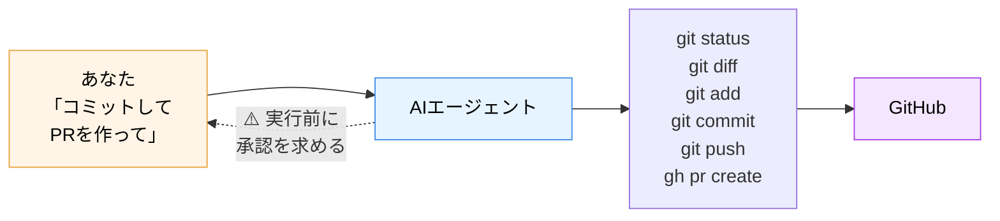

# 07. 番外編2 — AIエージェントによるGit自動操作

**所要：8〜10分（本編とは別枠）** ｜ 前 → [06. 安全な使い方](06_safety.md)

---

## 🛑 このページを読む前に

> ### **[04. ハンズオン本編](04_branch_pr.md) を、自分の手で1周してください。**
>
> まだの人は、ここで止まってください。**先に読んでも、何の役にも立ちません。**

### 順序を入れ替えない理由

「AIがやってくれるなら、最初からそれでよくない？」

もっともな疑問です。でも、答えは **No** です。理由は1つだけ。

> **AIが出してきた結果が正しいかどうかを、あなたが判定できないからです。**

AIは `git push --force` も実行できます。`.env` をcommitすることもできます。
そのコマンドが何をするか知らない人には、**それが事故なのか正常なのか区別がつきません。**

車の運転で言えば、自動運転は便利ですが、
**ハンドルとブレーキが何をするか知らない人が助手席に座っているだけ**なら、それは危険です。

あなたは本編で、
- 変更が **① 作業場 → ② ステージ → ③ ローカル → ④ GitHub** と進むことを知り
- **`git diff` の読み方**（`+` が追加、`-` が削除）を学び
- **commit前にdiffを見る習慣**を身につけました

**この3つがあって初めて、AIに任せる話が「便利」になります。** なければ「危険」です。

だから、この番外編は最後にあります。**あなたはもう、読む資格を得ています。**

---

## AIエージェントは、Gitを操作できます

近年のAIコーディングツールは、**自然言語の指示で、ターミナルコマンドを実行できます。**
つまり、`git add` も `git commit` も `git push` も、**PR作成まで**AIがやってくれます。

| ツール | 提供 | Git操作 |
|---|---|---|
| **Claude Code** | Anthropic | ✅ ターミナルで動作。add/commit/push/PR作成すべて可能 |
| **GitHub Copilot（Agent mode）** | GitHub | ✅ VS Code内で動作。ファイル編集からcommitまで |
| **Cursor** | Anysphere | ✅ エディタ内蔵のエージェント機能 |

### 何が起きているのか

魔法ではありません。**あなたが本編で打ったコマンドを、AIが代わりに打っているだけです。**



**AIが打っているコマンドは、あなたが今日打ったものと同じです。**
だから、本編をやった人には**画面に何が起きているか読めます。** これが今日の成果です。

---

## デモ：3つの指示例

講師が実演します。手元で試したい人は、[Claude Code](https://claude.com/claude-code) をインストールして
`git-lec` フォルダで `claude` と打つと使えます。

> 💡 **今すぐ試す必要はありません。** まずは画面を見て、「何が起きているか読めるか」を確認してください。

---

### 指示例1：状況を説明させる（いちばん安全で、いちばん実用的）

```
今のgitの状態を説明して。何がステージに乗っていて、何がまだ？
```

**AIがやること**

```bash
git status
git diff
git diff --staged
```

**期待する応答（例）**

> 現在 `feat/taro-yamada-profile` ブランチにいます。
>
> - **ステージ済み（②）**：`members/taro-yamada.md`（新規、15行追加）
> - **未ステージ（①）**：`README.md`（1行変更）
>
> `README.md` の変更は意図したものですか？ 自己紹介の追加とは別の変更に見えます。

**これがAIエージェントのいちばん健全な使い方です。**

- 何も破壊しません（読むだけのコマンドしか実行していない）
- `git status` の出力を日本語で説明してくれる
- **「これ意図してます？」と聞き返してくれる** ← 人間より丁寧なことがあります

> 💡 **困った時にAIに聞くのは、実は「コマンドを実行させる」より価値があります。**
> エラーメッセージを貼り付けて「これどういう意味？」と聞くだけで、
> 今日のトラブルの大半は自己解決できます。

---

### 指示例2：コミットまで任せる

```
members/ の変更をコミットして。メッセージは CONTRIBUTING.md のルールに従って。
```

**AIがやること**

```bash
git status                                # 何が変わったか確認
git diff                                  # 中身を確認
cat CONTRIBUTING.md                       # ルールを読む
git add members/taro-yamada.md            # 名指しでadd
git commit -m "feat: taro-yamada の自己紹介を追加"
```

**注目してほしいポイント**

1. **`git add .` ではなく、`members/` だけを名指ししている** ← 指示通りに範囲を絞っている
2. **`CONTRIBUTING.md` を読んでからメッセージを書いている** ← ルールに従っている
3. **実行前に「このコマンドを実行していいですか？」と聞いてくる** ← ここが最重要

### 🔴 ここであなたがやること

**実行を承認する前に、必ず2つを確認します。**

| 確認 | 見るもの | 何を見るか |
|---|---|---|
| ① **何が記録されるか** | `git diff --staged` の出力 | 意図したファイルだけか。`.env` や巨大ファイルが混ざっていないか |
| ② **どう記録されるか** | コミットメッセージ | 変更内容と合っているか。ルールに沿っているか |

**この2つの確認は、AIに任せられません。あなたの仕事です。**

理由：**「何が正しいか」を知っているのはあなただけだから**です。
AIはあなたの意図を推測しているだけで、**本当にそれをやりたかったのかは知りません。**

---

### 指示例3：PR作成まで任せる

```
このブランチをpushして、PRを作って。本文はテンプレートに従って、Issue #12 を閉じるようにして。
```

**AIがやること**

```bash
git push -u origin feat/taro-yamada-profile
cat .github/PULL_REQUEST_TEMPLATE.md
gh pr create --title "feat: taro-yamada の自己紹介を追加" --body "..."
```

**期待する応答（例）**

> PRを作成しました：https://github.com/guousuides/git-lec/pull/13
>
> 本文にはテンプレートに沿って変更内容を記載し、`close #12` を含めています。

### 🔴 ここであなたがやること

**PRのURLを開いて、自分の目で見る。**

- **Files changed** タブ → 意図したファイルだけか
- **Commits** タブ → コミットが自分のアカウントに紐付いているか（灰色シルエットでないか → [02_kusa.md](02_kusa.md)）
- **本文** → 事実と違うことが書かれていないか

> 💡 **AIが書いたPR本文が「盛られている」ことがあります。**
> やっていないテストを「テスト済み」と書いたり、変更していない箇所を説明に含めたり。
> **PRの内容に責任を持つのは、AIではなくあなたです。**

---

## 人間側の責任

ここがこのページの本題です。

### 責任1：diffとコミットメッセージは、必ず自分で確認して承認する

**これが唯一にして最大のルールです。**

```
✅ AIに任せていいこと          ❌ AIに任せてはいけないこと
─────────────────────────    ─────────────────────────
コマンドを打つ手間             「これでいいか」の判断
コミットメッセージの下書き      その内容が事実かの確認
定型的な操作の反復             何を含め、何を含めないかの決定
状況の説明・エラーの解説        最終的な承認
```

**AIエージェントは、実行前に必ず承認を求めてきます。**
その画面で **Enterを連打しないでください。** そこがあなたの唯一の関門です。

> 💡 承認画面で「毎回聞かれるのが面倒だから全部許可」に設定する機能があります。
> **慣れるまでは使わないでください。** 面倒さこそが安全装置です。

### 責任2：AIも間違えます

AIは、**自信満々に間違ったコマンドを実行します。** 実際に起きうる例：

#### 🔴 危険例1：`git push --force`

```
（あなた）「pushが rejected されたんだけど、なんとかして」
（AI）「リモートに変更があるようです。--force でpushします」
```

> **他の人のコミットがGitHubから消えます。**
>
> 正しい対処は `git pull` してから push、またはコンフリクト解消です（→ [05](05_extra_conflict_revert.md)）。
> **`--force` は「他人の履歴を上書きする」という意味だと知らないと、この提案を止められません。**

#### 🔴 危険例2：`git reset --hard`

```
（あなた）「さっきの変更、なかったことにして」
（AI）「git reset --hard HEAD~1 を実行します」
```

> **commitしていない作業も含めて、全部消えます。**
>
> あなたが望んでいたのは `git revert`（打ち消しコミットを作る）かもしれないし、
> `git reset --soft`（コミットだけ取り消して内容は残す）かもしれません。
> **「なかったことにして」は曖昧です。曖昧な指示は、AIが勝手に解釈します。**

#### 🔴 危険例3：`.env` のコミット

```
（あなた）「全部コミットしといて」
（AI）「git add -A && git commit を実行します」
```

> **`.gitignore` に書き忘れていた `.env` が、APIキーごとGitHubに公開されます。**
>
> 「全部」と言ったのはあなたです。AIは指示通りにやっただけです。
> → [06_safety.md](06_safety.md)

#### その他のよくある間違い

| AIがやりがちなこと | 何が問題か |
|---|---|
| `git add .` で無関係なファイルを巻き込む | 意図しない変更が混ざる |
| PR本文に、やっていないことを書く | 事実と違う記録が残る |
| 事実と違うコミットメッセージ | 半年後の自分が混乱する |
| コンフリクトを「片方を全部採用」で雑に解消 | **誰かの変更が黙って消える** |
| 存在しないブランチ名やIssue番号を書く | リンクが壊れる |

**これらは「AIがダメ」という話ではありません。**
**指示が曖昧だと、AIは合理的に見える解釈で埋める**、というだけの話です。

### 責任3：曖昧な指示を出さない

| ❌ 危ない指示 | ✅ 安全な指示 |
|---|---|
| 「全部コミットして」 | 「`members/` の変更だけをコミットして」 |
| 「なかったことにして」 | 「直前のコミットを revert して」 |
| 「pushできるようにして」 | 「なぜpushが拒否されたか説明して」 |
| 「いい感じにして」 | 「〜のルールに従って〜して」 |

**「なんとかして」は、いちばん危険な指示です。**
AIは必ず「なんとか」します。その手段があなたの望むものかは、別の話です。

---

## 本編とつながる話

### なぜ4領域モデルを学んだのか

AIが `git add` を実行した時、あなたは**「変更が ① から ② に移った」**と読めます。
`git commit` なら **② → ③**。`git push` なら **③ → ④**。

**AIの操作ログが、あなたには意味のある文章として読めます。**
4領域を知らなければ、それはただの英語の羅列です。

### なぜdiffの読み方を学んだのか

AIに承認を求められた時、あなたが見るのは **diff** です。

`+` が追加、`-` が削除。**これが読めなければ、承認ボタンを押す根拠がありません。**

**根拠なく押す承認は、承認ではなく放棄です。**

### なぜ手で1周したのか

**AIが「何をやったか」を、コマンドではなく意味で理解するためです。**

今日あなたが手で打った8個のコマンドは、AIが代わりに打つコマンドと**完全に同じ**です。
一度自分でやった人にとって、AIの操作は「知っている作業の自動化」です。
やったことがない人にとっては、「よく分からない何かが勝手に進む画面」です。

**同じ画面を見ていても、見えているものが違います。** これが今日の30分の価値です。

---

## ライブデモが動かなかった場合

**この節は、講師がライブデモを実施できない時の代替です。**
（ネットワーク不調、API制限、環境差異などはよく起きます）

以下のスクリーンショット・GIFで、同じ内容を確認できます。

| デモ | 素材 | 内容 |
|---|---|---|
| 指示例1：状況説明 | `images/ai_demo_01_status.png` | AIが `git status` を実行し、日本語で状況を説明 |
| 指示例2：コミット | `images/ai_demo_02_commit.gif` | **承認プロンプトが出る瞬間**を含む一連の流れ |
| 指示例3：PR作成 | `images/ai_demo_03_pr.gif` | pushからPR作成、URLが返るまで |
| 🔴 危険例：force push | `images/ai_demo_04_danger.png` | AIが `--force` を提案し、**人間が拒否する**画面 |

> 素材の置き場所 → [`docs/images/`](images/)
> 素材が未配置の場合は、[facilitator_guide.md](../facilitator_guide.md) の「素材の準備」を参照してください。

### 素材も無い場合の口頭説明用テキスト

講師はこれを読み上げるだけでも成立します：

> 「AIに『コミットしてPRを作って』と1行打つと、AIは `git status` と `git diff` を実行して
> 状況を把握し、コミットメッセージを提案してきます。
> ここで画面には**『このコマンドを実行していいですか？ y/n』**という確認が出ます。
>
> **この画面が今日のポイントです。**
> ここに出ているのは、みなさんがさっき手で打った `git add` と `git commit` そのものです。
>
> みなさんは今、この画面を見て『何が起きようとしているか』が読めます。
> 今日30分やったことの価値は、まさにここにあります。」

---

## 結論

AIエージェントは、Git操作の**手間**を消してくれます。
コマンドを覚える必要も、タイポに悩む必要も、もうありません。

**でも、Git操作の「責任」は消えません。**

- pushされたコードには、**あなたの名前**が入ります
- 消えた他人の作業の責任は、**あなた**が負います
- 漏れたAPIキーの請求は、**あなた**に来ます

**AIは、承認を求めてきます。承認するのはあなたです。**

そして、AIに任せる範囲が増えるほど、あなたが承認すべき判断の**1つあたりの重み**は増していきます。
手で10回コマンドを打っていた作業が、1回の承認に凝縮されるからです。

> ## **AIに任せる範囲が増えるほど、「何が起きたか」を読む力が要る。**

今日30分かけて手でやったことは、**AIを使うための前提条件**です。

**AIを使わないための知識ではなく、AIを安全に使い倒すための知識です。**

---

## このページのまとめ

- AIエージェント（Claude Code / Copilot / Cursor）は、**自然言語でGit操作を実行できる**
- AIが打つコマンドは、**あなたが今日打ったものと同じ**
- **diffとコミットメッセージの確認・承認は、人間の仕事。** ここは絶対に譲らない
- AIも間違える。特に **`push --force` / `reset --hard` / `.env` のcommit**
- **曖昧な指示（「全部」「なんとかして」）が事故の原因**
- **AIに任せる範囲が増えるほど、読む力が要る**

---

## 次に読むと良いもの

| 資料 | 内容 |
|---|---|
| [05. コンフリクトとrevert/reset](05_extra_conflict_revert.md) | `reset --hard` の危険性を、実際に手を動かして理解する |
| [06. 安全な使い方](06_safety.md) | `.env` を守る具体的な方法 |
| [Claude Code 公式ドキュメント](https://docs.claude.com/en/docs/claude-code) | 実際に使ってみたい人へ |

---

**← [目次（README）に戻る](../README.md)**
