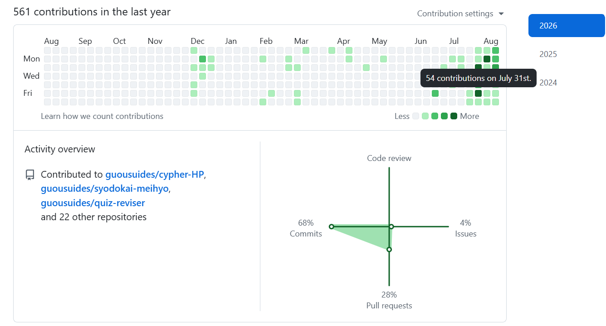

<!-- _class: lead -->
<!-- _paginate: false -->
<!-- _header: '' -->

<div style="text-align: center; margin-top: 30px;">
  <span class="tag tag-time">30分で完走</span>
  <span class="tag tag-concept">完全未経験歓迎</span>
  <span class="tag tag-gui">実践ハンズオン</span>

  <div class="lead-title" style="margin-top: 15px;">GitHub入門講座</div>
  <div class="subtitle">〜 Gitの仕組みを理解して、初めての草を生やそう 〜</div>

  <div style="color: #8b949e; font-size: 19px; margin-top: 25px;">
    <strong>Cypher-郭嘉宏</strong>（AI & Data Science Community）
  </div>
</div>

---

## この30~60分のゴール

<div class="card-highlight" style="font-size: 1.05em; text-align: center; padding: 12px 20px; margin-bottom: 12px;">
  <strong>🎯 皆さんのPull Requestがmergeされ、GitHubプロフィールに「草」が生えている状態！</strong>
</div>

<div class="card-grid" style="grid-template-columns: 1.1fr 0.9fr; align-items: center; gap: 14px;">
  <div>
    <div class="card" style="margin-bottom: 10px;">
      <h3 style="margin-bottom: 4px;">🌱 草を生やすとは？</h3>
      GitHubで開発活動（コミット・PR等）をした日に、プロフィールに付く<strong>緑のマス目（コントリビューション）</strong>のこと。
    </div>
    <div class="card">
      <h3 style="margin-bottom: 4px;">📬 Pull Request（PR）とは？</h3>
      「自分の変更を本番に取り込んでください！」という<strong>チームへのお願い・提案</strong>のこと。
    </div>
  </div>
  <div style="text-align: center;">
    
    <div style="font-size: 0.72em; color: #8b949e; margin-top: 4px;">▲ GitHubプロフィール画面（草が生えた状態）</div>
  </div>
</div>

---

## スタート前の環境クイックチェック

本講座は **GitHubアカウント作成済み** の状態からスタートします。<br>
手元のターミナル（Windowsは Git Bash / Macはターミナル）で動作確認しましょう！

| # | 確認項目 | 打つコマンド | 期待される結果 |
|---|---|---|---|
| 1 | Gitが入っている | `git --version` | `git version 2.xx.x` |
| 2 | 名前が登録されている | `git config --global user.name` | あなたのGitHub ID |
| 3 | メールが登録されている | `git config --global user.email` | GitHubの登録メール |
| 4 | GitHubログイン済み | `gh auth status` | `✓ Logged in to github.com` |

> ⚠️ 未設定の項目がある人や赤字のエラーが出た人は**遠慮なく声をかけてください**！

---

<!-- _class: lead -->
<!-- _header: '' -->

<span class="tag tag-time">第1章 (03–07分)</span>
<div class="lead-title" style="margin-top: 10px;">バージョン管理ってなに？</div>
<div class="subtitle">ファイルの歴史を記録する・タイムマシン機能</div>

---

## 「最終版_本当の最終.docx」ってどれなん？？？？

<div class="card-grid" style="margin-top: 20px; gap: 20px;">
  <div class="card" style="border-color: #ff7b72;">
    <h3 style="color: #ff7b72; margin-top: 0;">📁 こんなファイル名ありませんか？</h3>
    <ul style="line-height: 1.8; margin-bottom: 0;">
      <li><code>企画書_最新.docx</code></li>
      <li><code>企画書_最新_修正.docx</code></li>
      <li><code>企画書_本当の最終版.docx</code></li>
      <li><code>企画書_本当の最終版_修正2_田中.docx</code></li>
    </ul>
  </div>
  <div class="card-highlight" style="border-color: #da3633;">
    <h3 style="color: #ff7b72; margin-top: 0;">😱 発生する悲劇</h3>
    <ul style="line-height: 1.8; margin-bottom: 0;">
      <li>どれが本当の最新版か分からない！</li>
      <li>誰がどこを変更したか追えない！</li>
      <li>過去のバージョンに戻せない！</li>
      <li>上書き事故で大事なデータが消滅…</li>
    </ul>
  </div>
</div>

---

## Git（バージョン管理）を使うとどうなる？

<div class="card-highlight" style="text-align: center; padding: 14px; margin-bottom: 16px;">
  <strong style="font-size: 1.15em; color: #7ee787;">🎉 ファイル名は1つのまま！過去の全履歴をきれいに保存</strong>
</div>

<div class="card-grid" style="grid-template-columns: 1fr 1fr 1fr; gap: 14px;">
  <div class="card">
    <h3 style="color: #58a6ff;">⏰ タイムマシン機能</h3>
    過去の任意のセーブポイント（コミット）にいつでも安全に戻せる！
  </div>
  <div class="card">
    <h3 style="color: #7ee787;">🔍 1行単位の履歴</h3>
    「誰が・いつ・何を変更したか」がすべて完全に記録される！
  </div>
  <div class="card">
    <h3 style="color: #ffa657;">🌿 同時並行の開発</h3>
    複数人で同じファイルを編集しても壊れない（ブランチ機能）！
  </div>
</div>

---

<!-- _class: lead -->
<!-- _header: '' -->

<span class="tag tag-time">第2章 (07–11分)</span>
<div class="lead-title" style="margin-top: 10px;">Gitの仕組みと3大用語</div>
<div class="subtitle">荷物の発送にたとえて一発理解！</div>

---

## 覚える用語は3つだけ！

<div class="card-grid">
  <div class="card">
    <h3 style="color: #58a6ff;">📦 1. リポジトリ（Repository）</h3>
    ファイルや変更履歴をしまっておく<strong>「保存箱・貯蔵庫」</strong>のこと。<br>
    ・<strong>ローカルリポジトリ</strong>：自分のPC内<br>
    ・<strong>リモートリポジトリ</strong>：GitHub（クラウド）
  </div>
  <div class="card">
    <h3 style="color: #7ee787;">🔒 2. コミット（Commit）</h3>
    ファイルの変更をリポジトリに<strong>「記録・確定」</strong>すること。<br>
    「何を直したか」のメッセージ（コミットメッセージ）を添えて記録します。
  </div>
</div>

<div class="card" style="margin-top: 12px;">
  <h3 style="color: #ffa657;">🗂️ 3. ワークツリー と ステージ</h3>
  ・<strong>ワークツリー（作業場）</strong>：あなたが今実際にファイルを編集しているフォルダ。<br>
  ・<strong>ステージ（控え室）</strong>：コミットする前に「これだけ記録する」と選んだ変更を置く場所。
</div>

---

## 荷物の発送でたとえる「4領域モデル」

変更したファイルは、手元のPCからGitHub（クラウド）まで**4つの場所**を順番に移動します。

<div class="card-grid" style="grid-template-columns: 1fr 1fr; gap: 14px; margin-top: 15px;">
  <div class="card">
    <h3 style="color: #79c0ff;"><span class="step-num">1</span> ワークツリー（作業場）</h3>
    手元のPCでファイルを編集中の状態（部屋の机の上）
  </div>
  <div class="card">
    <h3 style="color: #ffa657;"><span class="step-num">2</span> ステージ</h3>
    <code>git add</code> で送る変更をダンボールに詰めた状態
  </div>
  <div class="card">
    <h3 style="color: #7ee787;"><span class="step-num">3</span> ローカルリポジトリ</h3>
    <code>git commit</code> でガムテープで封をして手元に保存
  </div>
  <div class="card">
    <h3 style="color: #a371f7;"><span class="step-num">4</span> リモートリポジトリ（GitHub）</h3>
    <code>git push</code> でクラウド郵便局へ発送・共有！
  </div>
</div>

---

## よくある疑問：「なぜインデックス（add）があるの？」

「ファイルを編集したら、そのまま保存（commit）じゃダメなの？」

<div class="card" style="margin-top: 15px;">
  <h3 style="color: #79c0ff;">💡 理由：関係ない変更を混ぜずに綺麗に記録するため！</h3>
  <p>例えば、同時に2つのファイルを編集したとします：</p>
  <ul>
    <li><code>login.py</code>（ログイン機能の追加） ➡️ <strong>今回のコミットに含めたい！</strong></li>
    <li><code>test_memo.txt</code>（個人的なメモ・落書き） ➡️ <strong>人に見せたくない…</strong></li>
  </ul>
  <p style="margin-top: 10px;">
    <code>git add login.py</code> とすることで、<strong>「送りたい物だけ」を綺麗に選んで箱詰め</strong>できます。
  </p>
</div>

---

## Git と GitHub の違い

名前は似ていますが、役割がまったく違います！

|  | Git（ギット） | GitHub（ギットハブ） |
|---|---|---|
| **正体** | あなたのPCに入る**アプリ・道具** | ネット上の**Webサービス** |
| **場所** | 手元のパソコンの中 | クラウド（インターネット） |
| **役割** | ファイルの変更履歴を**記録**する | 履歴を**共有**してみんなで開発する |
| **ネット** | **不要**（オフラインで動く！） | 必要 |

> **たとえ**：Git = <strong>カメラ（撮影する道具）</strong> ｜ GitHub = <strong>Instagram（写真を共有する場所）</strong>

---

<!-- _class: lead -->
<!-- _header: '' -->

<span class="tag tag-time">第3章 (11–13分)</span>
<div class="lead-title" style="margin-top: 10px;">ターミナルの基本</div>
<div class="subtitle">黒い画面は「文字でおしゃべりする道具」</div>

---

## ターミナルで一番大事なこと：「今どこにいるか」

ターミナルは「今いる場所（カレントディレクトリ）」を基準にして動きます。

<div class="card-highlight" style="margin: 12px 0;">
  <strong>カレントディレクトリ</strong>（Current Directory）＝ ターミナルが今開いているフォルダのこと
</div>

```
/Users/taro/
  ├── Desktop/      ← デスクトップ
  ├── Downloads/    ← ダウンロード
  └── Documents/    ← 書類
```

- 今 `Desktop` にいるのか？ それとも `Downloads` にいるのか？
- **場所を見失ったら、まず「今どこ？」を確認する**のが鉄則です！

---

## 覚えるコマンドはとりま3つだけ！

<div class="card-grid">
  <div class="card">
    <h3><code>pwd</code>（今どこ？）</h3>
    <strong>P</strong>rint <strong>W</strong>orking <strong>D</strong>irectory<br>
    今いるフォルダの場所（パス）を表示します。
  </div>
  <div class="card">
    <h3><code>ls</code>（何がある？）</h3>
    <strong>L</strong>i<strong>s</strong>t<br>
    今いるフォルダの中にあるファイル一覧を表示します。
  </div>
</div>

<div class="card" style="margin-top: 12px;">
  <h3><code>cd フォルダ名</code>（そこへ移動！）</h3>
  <strong>C</strong>hange <strong>D</strong>irectory<br>
  指定したフォルダの中に移動します。（例：<code>cd Desktop</code> でデスクトップへ移動）<br>
  ※ <code>cd ..</code>（ドット2つ）で「1つ上の階層に戻る」
</div>

---

<!-- _class: lead -->
<!-- _header: '' -->

<span class="tag tag-time">第4章 (13–24分)</span>
<div class="lead-title" style="margin-top: 10px;">ハンズオン本編！</div>
<div class="subtitle">自己紹介ファイルを作って Pull Request を出そう</div>

---

## これからやるハンズオンの流れ（GitHub Flow）

実務のエンジニアが毎日やっている「王道の開発手順」を体験します！

<div style="font-size: 0.9em; margin-top: 12px;">

1. 📥 **clone** ➡️ プロジェクトを自分のPCに持ってくる
2. 🌿 **branch** ➡️ 自分専用の作業ブランチ（枝）を作る
3. 📝 **編集** ➡️ `members/あなたのID.md` を作成して自己紹介を書く
4. 📦 **add** ➡️ 変更をインデックス（発送箱）に入れる
5. 🔒 **commit** ➡️ 変更を手元の記録として確定する
6. 🚀 **push** ➡️ GitHubに送り届ける
7. 📬 **PR作成** ➡️ 「取り込んでください！」とPRを出す
8. 🎉 **Merge** ➡️ レビュー・承認されて合体！

</div>

---

## Step 1. リポジトリを手元に持ってくる

<span class="tag tag-cli">CLI</span> `Desktop` に移動して、リポジトリを丸ごと複製（clone）します。

```bash
cd Desktop
git clone https://github.com/guousuides/git-lec.git
```

<span class="tag tag-gui">VS Code</span> 「クローン」ボタンを押し、上のURLを貼り付けます。

<div class="card" style="margin-top: 10px;">
  <strong>期待される結果：</strong> デスクトップに <code>git-lec</code> フォルダが新しく作られます！
</div>

```bash
cd git-lec
```
> ⚠️ **超重要**：必ず `cd git-lec` でフォルダの中に入ってください！

---

## Step 2. 自分専用の作業ブランチを作る

みんなで同じ本番（`main`）を直接いじると事故が起きます。<br>
安全のため「自分専用の枝分かれ（ブランチ）」を作って作業します。

<span class="tag tag-cli">CLI</span> 自分のID名でブランチを作成して切り替えます：

```bash
git switch -c add-member-あなたのID
```
*(例：`git switch -c add-member-taro-yamada`)*

<span class="tag tag-gui">VS Code</span> 左下の `main` をクリック ➡️ 「新しい分岐の作成」

<div class="card" style="margin-top: 10px;">
  <strong>期待される結果：</strong> <code>Switched to a new branch 'add-member-...'</code> と出ればOK！
</div>

---

## Step 3. 自己紹介ファイルを作る

`members/` フォルダの中に、**`あなたのGitHub ID.md`** を作成します！

<div class="card-grid">
  <div class="card">
    <h3 style="color: #79c0ff;">📁 ファイルの場所</h3>
    <code>members/taro-yamada.md</code><br>
    <em>（※拡張子は <code>.md</code> です）</em>
  </div>
  <div class="card">
    <h3 style="color: #7ee787;">✍️ 中に書く内容（自由）</h3>
    <pre><code># 自己紹介

- **名前**: 山田 太郎
- **所属**: ○○大学 / Cypher
- **一言**: GitHubマスターになります！</code></pre>
  </div>
</div>

> 💡 VS Codeのエクスプローラーから `members` フォルダを右クリックして「新規ファイル」で作ると簡単です！

---

## Step 4. 今の状態を確認する

今、Gitから見てファイルがどうなっているか確認してみましょう！

```bash
git status
```

<div class="card" style="margin-top: 10px;">
  <pre><code>Untracked files:
  (use "git add &lt;file&gt;..." to include in what will be committed)
	members/taro-yamada.md   # ← 赤文字で表示されます！</code></pre>
</div>

- **赤文字（Untracked）** ＝ 「部屋に新しい物があるけど、まだ発送箱（ステージ）には入っていませんよ」という合図です。

---

## Step 5. 発送箱に入れる（add）

作成した自己紹介ファイルを、インデックス（発送箱）に乗せます。

<span class="tag tag-cli">CLI</span> 
```bash
git add members/あなたのID.md
```
*(または `git add .` で今のフォルダの全変更をステージ)*

<span class="tag tag-gui">VS Code</span> ソース管理パネルで、ファイル名の横の **「+」ボタン** をクリック

もう一度 `git status` を打ってみましょう：
<div class="card">
  <pre><code>Changes to be committed:
	new file:   members/taro-yamada.md   # ← 緑文字に変わった！</code></pre>
</div>

---

## Step 6. 記録を確定して封をする（commit）

「何を変更したか」のメッセージを添えて、手元に記録します。

<span class="tag tag-cli">CLI</span>
```bash
git commit -m "docs: add taro-yamada to members"
```

<span class="tag tag-gui">VS Code</span> メッセージ欄に `docs: add ...` と入力して **「コミット」** ボタン

<div class="card" style="margin-top: 10px;">
  <pre><code>[add-member-taro-yamada a1b2c3d] docs: add taro-yamada to members
 1 file changed, 5 insertions(+)
 create mode 100644 members/taro-yamada.md</code></pre>
  <em>これで「PC内の保存箱」にしっかり記録されました！🎉</em>
</div>

---

## Step 7. GitHubへ送り出す（push）

手元に作った記録を、インターネット上のGitHubへアップロードします！

<span class="tag tag-cli">CLI</span>
```bash
git push -u origin add-member-あなたのID
```

<span class="tag tag-gui">VS Code</span> **「ブランチの発行」** または **「変更の同期」** ボタン

<div class="card" style="margin-top: 10px;">
  <pre><code>To https://github.com/guousuides/git-lec.git
 * [new branch]      add-member-taro-yamada -> add-member-taro-yamada
Branch 'add-member-taro-yamada' set up to track remote branch.</code></pre>
  <em>GitHubにあなたのブランチが届きました！🚀</em>
</div>

---

## Step 8. Pull Request（PR）を作成する

<div class="card-highlight" style="margin-bottom: 14px; padding: 12px 18px;">
  <strong style="font-size: 1.05em; color: #58a6ff;">📬 Pull Request（PR）とは？</strong><br>
  「自分の変更を本番に取り込んでください！」という<strong>チームへのお願い・提案</strong>のことです。
</div>

<div class="card-grid">
  <div class="card">
    <h3 style="color: #79c0ff;">🖱️ GitHub画面での操作手順</h3>
    <ol style="padding-left: 20px; line-height: 1.7; margin-bottom: 0;">
      <li>リポジトリ（<code>git-lec</code>）のトップを開く</li>
      <li>上部の黄色いバー <strong>「Compare & pull request」</strong> をクリック</li>
      <li>タイトルと本文を確認して <strong>「Create pull request」</strong> をクリック！</li>
    </ol>
  </div>
  <div class="card">
    <h3 style="color: #7ee787;">💡 なぜPRを作るの？</h3>
    <ul style="line-height: 1.7; margin-bottom: 0;">
      <li>いきなり本番に合体させず、事前に内容をレビューできる！</li>
      <li>チーム全員に「何を追加したか」を共有できる！</li>
    </ul>
  </div>
</div>

---

## Step 9. レビュー & Merge！🎉

<div class="card-highlight" style="text-align: center; padding: 20px; margin-top: 10px;">
  <h2 style="color: #7ee787; border: none; margin-bottom: 8px;">🎉 その場で全員のPRをMerge（合体・承認）します！</h2>
  <p style="font-size: 1.05em; margin: 0;">
    GitHub上のPR画面が <strong>「Merged (紫色のアイコン)」</strong> に変わる瞬間を見届けましょう！
  </p>
</div>

<div style="margin-top: 15px; text-align: center;">
  紫色の <code>Merged</code> マークがついたら、<strong>あなたの一連の作業は大成功です！</strong> 🎊
</div>

---

<!-- _class: lead -->
<!-- _header: '' -->

<span class="tag tag-time">第5章 (24–27分)</span>
<div class="lead-title" style="margin-top: 10px;">草を確認しよう！</div>
<div class="subtitle">プロフィールに緑色のマス目はついたかな？</div>

---

## 自分のプロフィールを見に行こう！

ブラウザで自分のプロフィールページを開いてみましょう：
**`https://github.com/あなたのID`**

<div class="card-highlight" style="margin-top: 15px; text-align: center; padding: 18px;">
  <span style="font-size: 1.8em;">🟩 🟩 🟩 🟩 🟩</span><br>
  <strong style="font-size: 1.15em; color: #7ee787;">今日のマス目に色がついて「草」が生えています！</strong>
</div>

> 「草が生える」＝ あなたが世界に向けてオープンな開発活動を一歩踏み出した証拠です！

---

## 🚨 もし草が生えていなかったら？「3大罠」

「PRはマージされたのに草が生えていない！」という場合のチェックリスト：

<div class="card-grid">
  <div class="card">
    <h3 style="color: #ff7b72;">罠① メールアドレスの不一致（90%はこれ）</h3>
    <code>git config user.email</code> のメアドと、GitHubに登録されているメアドが1文字でも違うと草になりません。
  </div>
  <div class="card">
    <h3 style="color: #ff7b72;">罠② まだマージされていない</h3>
    ブランチにコミットしただけでは草になりません。<code>main</code> にマージされて初めて反映されます。
  </div>
</div>

<div class="card" style="margin-top: 12px;">
  <h3 style="color: #ff7b72;">罠③ 自分のFork（コピーリポジトリ）で作業してしまった</h3>
  Fork先のコミットは、元のリポジトリにPRを出してマージされるまで草カウントされません。
</div>

---

## 罠①（メアド不一致）の治し方

ターミナルで設定を修正し、GitHub側にもメールを追加すれば解決します！

```bash
# 1. 今の設定を確認
git config --global user.email

# 2. GitHubに登録しているメアドに上書き設定
git config --global user.email "your-correct-email@example.com"
```

> 💡 GitHubの [Settings] ➡️ [Emails] に、PC側で設定していたメールアドレスを追加登録することでも、過去のコミットが自分のものとして紐づけられて草が生えます！

---

<!-- _class: lead -->
<!-- _header: '' -->

<span class="tag tag-time">第6章 (27–30分)</span>
<div class="lead-title" style="margin-top: 10px;">まとめ & AI時代のGit</div>
<div class="subtitle">AIがコマンドを打つ時代に、人間は何をするのか？</div>

---

## 今日できるようになったこと 🎓

たった30分で、実務のエンジニアと同じスキルを習得しました！

<div class="card" style="margin-top: 15px;">

- ✅ **バージョン管理の基礎**（ファイルの歴史を綺麗に記録・復元できる）
- ✅ **Gitの4領域モデル**（作業場 ➡️ インデックス ➡️ ローカル ➡️ リモート）
- ✅ **GitHub Flowの実践**（clone ➡️ branch ➡️ commit ➡️ push ➡️ PR）
- ✅ **草を生やす仕組み**（メール認証・マージ条件）

</div>

---

## 番外編1：コンフリクト（衝突）と元に戻す方法

同じファイルの同じ行を2人が同時に編集すると**「コンフリクト（衝突）」**が起きます。

<div class="card-grid" style="margin-top: 15px;">
  <div class="card">
    <h3>⚔️ コンフリクトは怖くない</h3>
    Gitが「どっちを採用する？」と親切に聞いてくれている状態です。VS Codeならボタン1つで選べます。
  </div>
  <div class="card">
    <h3>⏪ やり直す道具（revert）</h3>
    間違えてマージした時は <code>git revert</code> で「打ち消すコミット」を作れば安全に戻せます。
  </div>
</div>

> 詳しくは 📄 `docs/05_extra_conflict_revert.md` と `conflict-playground/` をチェック！

---

## 番外編2：AIエージェント時代のGit操作

### AIがGitを自律操作する時代へ
Claude Code や GitHub Copilot が、**自然言語の指示だけで一連のGit作業を自動完結**させます。

<div class="card-grid" style="margin-top: 15px;">
  <div class="card-highlight" style="border-color: #58a6ff;">
    <h3 style="color: #58a6ff; margin-top: 0;">💬 人間の指示</h3>
    <p style="font-size: 0.95em; line-height: 1.6; margin: 0;">
      「自己紹介ファイルを追加して、ブランチを切ってPRまで作っておいて」
    </p>
  </div>
  <div class="card" style="border-color: #7ee787;">
    <h3 style="color: #7ee787; margin-top: 0;">🤖 AIエージェントの自動実行</h3>
    <p style="font-size: 0.88em; line-height: 1.6; margin: 0;">
      1. <code>git switch -c add-member-taro</code><br>
      2. ファイル作成 & <code>git add .</code><br>
      3. <code>git commit -m "docs: add..."</code><br>
      4. <code>git push</code> & PR作成（完了！）
    </p>
  </div>
</div>

---

## なぜAI時代に「4領域」と「diff」を学ぶのか？

<div class="card-grid" style="margin-top: 15px;">
  <div class="card">
    <h3 style="color: #ff7b72;">⚠️ AIも間違える</h3>
    <ul>
      <li>パスワードや <code>.env</code> をコミットしてしまう</li>
      <li>消してはいけないコードを消してしまう</li>
      <li>勝手に <code>push --force</code> してしまう</li>
    </ul>
  </div>
  <div class="card">
    <h3 style="color: #7ee787;">🛡️ 人間の最後の責任</h3>
    <ul>
      <li>AIが出した<strong>差分（diff）を自分の目で読む</strong></li>
      <li>「今どの領域に何があるか」を把握する</li>
      <li>問題がないことを確認して<strong>承認（Approve）</strong>する</li>
    </ul>
  </div>
</div>

<div class="card-highlight" style="margin-top: 15px; text-align: center;">
  <strong>「AIに任せる範囲が増えるほど、何が起きたかを読み解く力が武器になる」</strong>
</div>

---

## これからのおすすめアクション

<div class="card-grid">
  <div class="card">
    <span class="step-num">1</span><strong>もう1回PRを出してみる</strong><br>
    <code>members/あなたのID.md</code> を編集して、趣味や特技を追記してPRを出してみよう！2回目は驚くほどスムーズです。
  </div>
  <div class="card">
    <span class="step-num">2</span><strong>自分のリポジトリを作る</strong><br>
    大学のレポートやプログラミングの学習記録をGitHubで管理してみよう！
  </div>
</div>

<div class="card" style="margin-top: 12px;">
  <span class="step-num">3</span><strong>Cypherのプロジェクトに参加する</strong><br>
  コミュニティの開発プロジェクトで、仲間と一緒にチーム開発を実践しよう！
</div>

---

<!-- _class: lead -->
<!-- _header: '' -->

<div style="text-align: center; margin-top: 30px;">
  <div class="lead-title" style="font-size: 48px; color: #7ee787;">Happy Hacking! 🌿</div>
  <div class="subtitle" style="font-size: 26px; color: #c9d1d9; margin-top: 15px;">
    GitHubの世界へようこそ！
  </div>

  <div style="color: #8b949e; font-size: 19px; margin-top: 30px;">
    学生AI/データサイエンスコミュニティ <strong>Cypher</strong>
  </div>
</div>
